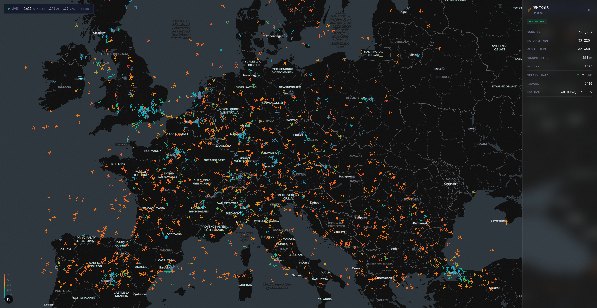
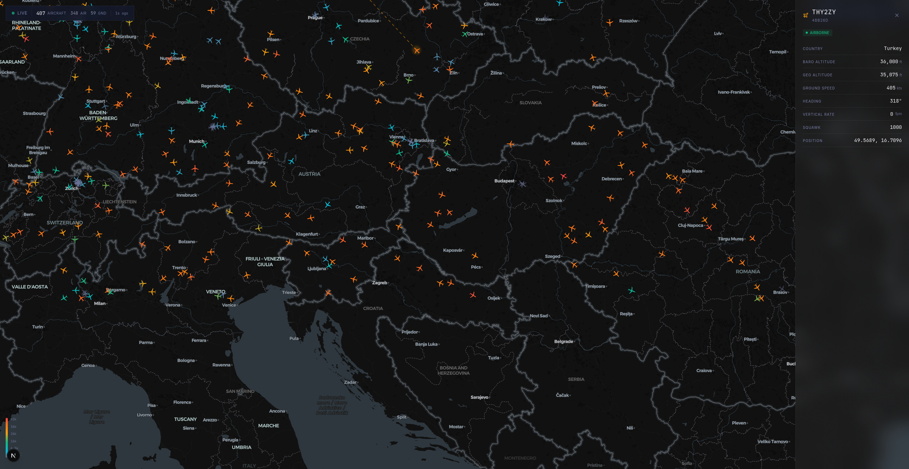

# SkyPulse

Real-time flight tracker with smooth aircraft animation, powered by OpenSky Network.



## Features

- **Real-time aircraft tracking** — Live positions from OpenSky Network API with 5-second polling
- **Smooth 30fps animation** — Dead-reckoning interpolation for fluid aircraft movement between updates
- **GPU-accelerated icons** — SDF (Signed Distance Field) aircraft icons colored by altitude
- **Flight detail panel** — Click any aircraft to see callsign, altitude, speed, heading, squawk, and more
- **Flight routes** — Departure and destination airports with flight progress bar (via AdsbDB)
- **Callsign search** — Type-ahead search with dropdown results
- **Advanced filters** — Filter by altitude range, speed, on-ground status, and aircraft category
- **Weather radar** — RainViewer precipitation overlay toggle
- **Dark/light theme** — Full theme support with glassmorphism UI
- **Geolocation** — Center the map on your current position
- **Screenshot export** — Capture the current map view as an image
- **Statistics panel** — Live aircraft count, altitude distribution, speed stats
- **Airport labels** — Major airport markers on the map
- **Flight trail** — Historical position trail for selected aircraft
- **Emergency alerts** — Squawk code detection (7500 hijack, 7600 radio failure, 7700 emergency)
- **Share flight links** — URL state persistence for sharing specific views
- **Keyboard shortcuts** — Escape to close panels, intuitive navigation
- **Mobile-friendly** — Responsive design with swipe-to-close panels
- **OAuth2 API access** — Authenticated requests for higher rate limits



## Tech Stack

| Technology | Version | Purpose |
|-----------|---------|---------|
| [Next.js](https://nextjs.org/) | 16 | React framework with App Router |
| [React](https://react.dev/) | 19 | UI with React Compiler |
| [MapLibre GL](https://maplibre.org/) | 5.18 | GPU-accelerated vector map rendering |
| [Tailwind CSS](https://tailwindcss.com/) | 4 | Utility-first styling |
| [Lucide React](https://lucide.dev/) | 0.563 | Icon library |
| [TypeScript](https://www.typescriptlang.org/) | 5 | Type safety |

## Architecture

```
┌─────────────────────────────────────────────────────────────┐
│                     Browser (React 19)                       │
│                                                              │
│  ┌──────────┐  ┌────────────┐  ┌──────────┐  ┌───────────┐ │
│  │ FlightMap │  │ FlightPanel│  │SearchBar │  │FilterPanel│ │
│  │ (MapLibre)│  │  (Detail)  │  │          │  │           │ │
│  └─────┬─────┘  └─────┬──────┘  └─────┬────┘  └─────┬─────┘ │
│        │              │              │             │         │
│  ┌─────┴──────────────┴──────────────┴─────────────┴──────┐ │
│  │              Custom React Hooks                         │ │
│  │  useFlightData · useInterpolation · useFlightRoute     │ │
│  │  useFlightHistory · useFlightFilters · useMapBounds    │ │
│  └─────────────────────┬───────────────────────────────────┘ │
└────────────────────────┼─────────────────────────────────────┘
                         │ fetch (5s polling)
┌────────────────────────┼─────────────────────────────────────┐
│                  Next.js API Routes                           │
│                                                              │
│  /api/flights ──→ OpenSky Network (all visible aircraft)    │
│  /api/flight  ──→ OpenSky Network (single aircraft, 1s)    │
│  /api/route   ──→ AdsbDB (departure/destination lookup)     │
│                                                              │
│  Features: OAuth2 tokens · Response caching · Rate limiting │
└──────────────────────────────────────────────────────────────┘
```

**Data flow:** The map viewport bounds are sent to `/api/flights` every 5 seconds. The API proxy fetches from OpenSky Network (with OAuth2 if configured), caches responses, and returns normalized flight data. The `useInterpolation` hook then animates aircraft positions at 30fps using dead-reckoning between updates. When a user selects an aircraft, `/api/flight` polls that specific aircraft every second, and `/api/route` fetches the flight route from AdsbDB.

## Getting Started

### Prerequisites

- Node.js 18+ (20+ recommended)
- npm, yarn, or pnpm

### Installation

```bash
git clone https://github.com/pattas/skypulse.git
cd skypulse
npm install
```

### Environment Setup (Optional)

Copy the example environment file and add your OpenSky Network credentials for higher API rate limits:

```bash
cp .env.local.example .env.local
```

Edit `.env.local` with your credentials from [OpenSky Network](https://opensky-network.org/). Without credentials, the app still works but with lower rate limits (anonymous: ~100 req/day, authenticated: ~4000 req/day).

### Run

```bash
npm run dev
```

Open [http://localhost:3000](http://localhost:3000) in your browser.

### Build

```bash
npm run build
npm start
```

## Environment Variables

| Variable | Required | Description |
|----------|----------|-------------|
| `OPENSKY_CLIENT_ID` | No | OpenSky Network OAuth2 client ID |
| `OPENSKY_CLIENT_SECRET` | No | OpenSky Network OAuth2 client secret |

## Project Structure

```
src/
├── app/
│   ├── api/
│   │   ├── flights/route.ts    # Bulk aircraft positions endpoint
│   │   ├── flight/route.ts     # Single aircraft tracking endpoint
│   │   └── route/route.ts      # Flight route lookup endpoint
│   ├── page.tsx                # Main application page
│   ├── layout.tsx              # Root layout with metadata
│   ├── globals.css             # Tailwind + custom styles
│   └── error.tsx               # Error boundary
├── components/
│   ├── FlightMap.tsx           # MapLibre GL map with aircraft layer
│   ├── FlightPanel.tsx         # Aircraft detail sliding panel
│   ├── FilterPanel.tsx         # Altitude/speed/category filters
│   ├── SearchBar.tsx           # Callsign search with autocomplete
│   ├── StatsBar.tsx            # Top stats bar (aircraft count)
│   ├── StatsPanel.tsx          # Detailed statistics panel
│   ├── AircraftTooltip.tsx     # Hover tooltip for aircraft
│   ├── AirportPopup.tsx        # Airport info popup
│   ├── AltitudeLegend.tsx      # Color legend for altitude
│   ├── GeolocationButton.tsx   # GPS location button
│   ├── ScreenshotButton.tsx    # Map screenshot capture
│   ├── ThemeToggle.tsx         # Dark/light theme switch
│   ├── WeatherToggle.tsx       # RainViewer radar toggle
│   └── map/
│       └── setupMapSourcesAndLayers.ts  # Map layer configuration
├── hooks/
│   ├── useFlightData.ts        # Flight data fetching & state
│   ├── useInterpolation.ts     # 30fps position interpolation
│   ├── useFlightRoute.ts       # Route lookup (departure/destination)
│   ├── useFlightHistory.ts     # Position trail history
│   ├── useFlightFilters.ts     # Filter state management
│   ├── useMapBounds.ts         # Viewport bounds tracking
│   ├── useSelectedFlightTracking.ts  # 1s polling for selected aircraft
│   └── useUrlState.ts          # URL state persistence
├── lib/
│   ├── types.ts                # TypeScript interfaces
│   ├── constants.ts            # App configuration constants
│   ├── colors.ts               # Altitude-to-color mapping
│   ├── geo.ts                  # Geodesy utilities (distance, bearing)
│   ├── interpolation.ts        # Position interpolation math
│   ├── aircraft-icon.ts        # SDF icon registration
│   ├── aircraft-category.ts    # ICAO aircraft category mapping
│   ├── airport-index.ts        # Airport data indexing
│   ├── squawk.ts               # Emergency squawk detection
│   ├── position-source.ts      # ADS-B/MLAT/FLARM source mapping
│   ├── opensky-auth.ts         # OAuth2 token management
│   ├── opensky-state.ts        # OpenSky API state parsing
│   ├── adsbdb.ts               # AdsbDB route API client
│   ├── units.ts                # Unit conversion utilities
│   └── z-index.ts              # Z-index constants
└── data/
    └── airports.json           # Airport database
```

## API Endpoints

| Endpoint | Method | Parameters | Description |
|----------|--------|-----------|-------------|
| `/api/flights` | GET | `lamin`, `lomin`, `lamax`, `lomax` (bounding box) | Fetch all aircraft within viewport |
| `/api/flight` | GET | `icao24` (aircraft ICAO address) | Fetch single aircraft state |
| `/api/route` | GET | `callsign` (flight callsign) | Look up flight route (departure/destination) |

## Key Technical Details

### SDF Aircraft Icons

Aircraft are rendered as Signed Distance Field (SDF) icons on the MapLibre GL map. SDF allows the GPU to color and scale icons without pixelation, enabling altitude-based coloring (blue → cyan → green → yellow → orange → red) with a single icon texture.

### Position Interpolation

Between 5-second API updates, aircraft positions are interpolated at 30fps using dead-reckoning: each aircraft's last known position, heading, and speed are used to project where it should be right now. This creates smooth, realistic movement instead of jumpy position updates.

### Server-Side Caching

API routes implement in-memory response caching to minimize calls to OpenSky Network. The bulk endpoint caches by bounding box with a 4-second TTL, and the single-aircraft endpoint caches per ICAO24 address with a 1-second TTL.

### OAuth2 Authentication

When configured, the API proxy uses OAuth2 client credentials flow to authenticate with OpenSky Network, providing significantly higher rate limits (anonymous: ~100 requests/day, authenticated: ~4000 requests/day).

## Code Review Summary

The codebase underwent three comprehensive code reviews covering API routes, React components, and hooks/utilities:

**Strengths:**
- Clean project architecture with good separation of concerns
- Strong TypeScript usage with well-defined interfaces
- Modular hook design (data fetching, interpolation, filtering, routing)
- Effective caching strategy and rate limit handling in API routes
- Smooth animation system using requestAnimationFrame

**Areas for Improvement:**
- **Performance** — Several components would benefit from `React.memo` and `useMemo` to reduce unnecessary re-renders
- **Memory management** — Some MapLibre event listeners need cleanup on unmount
- **Accessibility** — Missing ARIA labels and keyboard navigation in several components
- **API hardening** — Runtime validation of external API responses, structured error logging
- **Code duplication** — OAuth token fetching and state transformation logic is repeated across API routes

A detailed action plan with 72 identified issues and fixes is available in the code review documents.

## Known Issues & Roadmap

- [ ] OpenSky Network free tier has strict rate limits — consider caching improvements
- [ ] Aircraft type icons (helicopter, jet, prop) not yet differentiated
- [ ] No WebSocket support — currently polling-based only
- [ ] Airport runway/taxiway detail not shown at high zoom
- [ ] Missing service worker for offline map tile caching
- [ ] No unit tests yet

## License

MIT

## Credits

- [OpenSky Network](https://opensky-network.org/) — Live aircraft position data
- [AdsbDB](https://www.adsbdb.com/) — Flight route and aircraft information
- [RainViewer](https://www.rainviewer.com/) — Weather radar tiles
- [CartoDB](https://carto.com/) — Dark Matter and Voyager map basemaps
- [MapLibre GL JS](https://maplibre.org/) — Open-source map rendering engine
- [Lucide](https://lucide.dev/) — Icon library
